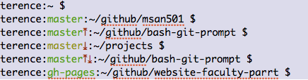

bash-git-prompt
===============

# What/Why?

My own variation on the bash git prompt. I took much of the functionality
from [magicmonty/bash-git-prompt](https://github.com/magicmonty/bash-git-prompt/blob/master/gitstatus.py). I wanted something simpler in functionality and implementation. Created some functions to organize. It looks like this:



It shows the branch you are on and whether it is clean (no staged or modified files) or not with a green or yellow branch name.

It shows upward arrow if you are ahead and downward arrow if you are behind or both.

# Install

You can put file [`parrt-prompt.py`](https://github.com/parrt/bash-git-prompt/blob/master/parrt-prompt.py) anywhere but that incantation below assumes it's in the `~/.bash` directory. 

Add the following incantation to your `.bash_profile` or `.bashrc`, if you are using that file.

```
PROMPT_COMMAND='PS1="`python ~/.bash/parrt-prompt.py`"'
```

If you want to get fancy, the following variation will also set the title of the window (on OS X at least) to the current working directory.

```
PROMPT_COMMAND='echo -n -e "\033]0;`pwd`\007"; PS1="`python ~/.bash/parrt-prompt.py`"'
```

# Misc

You might want to update the bash that sits on OS X by default:

```
$ bash --version
GNU bash, version 3.2.51(1)-release (x86_64-apple-darwin13)
Copyright (C) 2007 Free Software Foundation, Inc.
$ brew install bash
...
$ bash # launch new shell in this window or open new tab/window.
$ bash --version
GNU bash, version 4.3.18(1)-release (x86_64-apple-darwin13.3.0)
Copyright (C) 2013 Free Software Foundation, Inc.
License GPLv3+: GNU GPL version 3 or later <http://gnu.org/licenses/gpl.html>

This is free software; you are free to change and redistribute it.
There is NO WARRANTY, to the extent permitted by law.
$
```


